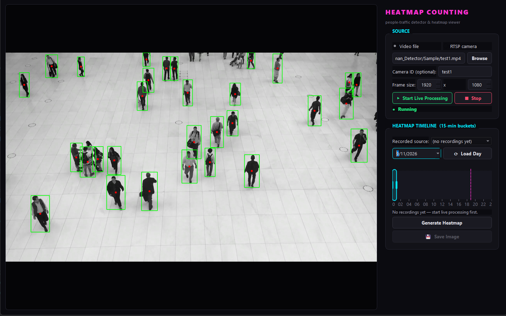
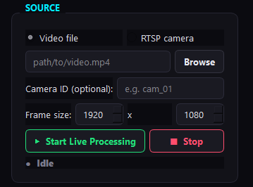
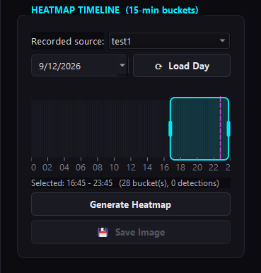
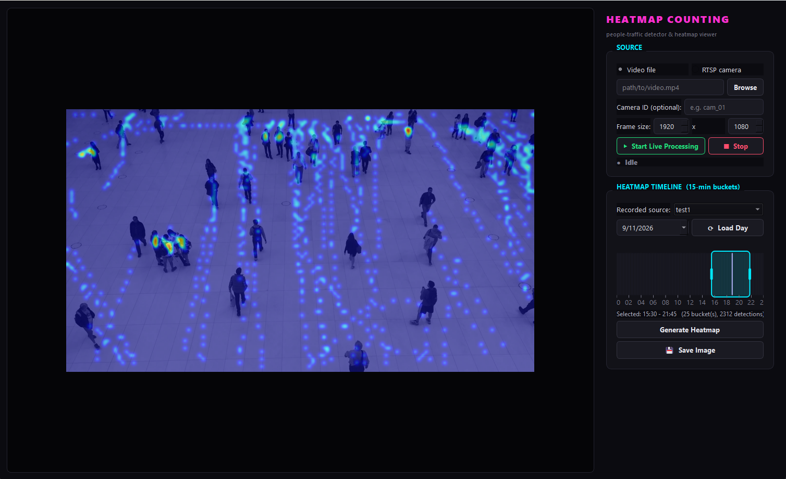
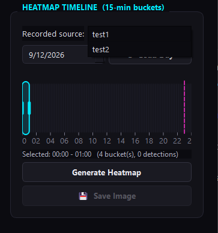

# People-Traffic Heatmap

**See where people actually walk — not just how many pass by.**

A desktop tool that watches a video (a recorded clip or a live camera) and
turns foot traffic into a heatmap: pick any date and time window, and see
exactly where people spent the most time in that window, drawn right on top
of the real scene.

  
   
  <em>Live view — people are detected as they move through frame.</em>

---

## 🎥 Demo

  

*(Short screen recording of the full flow: loading a video, watching it
process live, then generating and saving a heatmap for a chosen time
window.)*

▶️ Full-length video: **[link to be added]**

---

## What it does

- Watches a **video file or a live RTSP camera** and detects people frame by frame.
- Remembers *when and where* every person was seen, broken down into
  15-minute time windows across the day.
- Lets you **scrub through any time range** on a timeline and instantly
  generate a heatmap for just that window — the last 15 minutes, a whole
  shift, a full day, whatever you need.
- Keeps recordings from **different cameras or videos separate**, so you can
  switch between sources and compare them.
- **Saves the result as an image** with one click.

## ✨ Features

- **Live processing view** — watch detections happen in real time, with a
  running heatmap overlay on the video itself.
- **Interactive timeline** — a full 24-hour bar you can drag across to pick
  a time window, resize it from either edge, or drag the whole selection
  around. It's shaded by how much traffic was recorded in each slice, so
  busy periods are visible at a glance.
- **Multi-source support** — every camera or test video gets its own named
  folder, and a dropdown lets you jump between them when reviewing data.
- **RTSP-resilient** — automatically reconnects if a live camera stream drops.
- **One-click export** — save any generated heatmap as a PNG.
- **Dark, neon-themed interface** designed for a monitoring/analytics feel.

## 📸 Screenshots

<table>
  <tr>
    <td align="center">
       
      Choosing a video / camera source
    </td>
    <td align="center">
       
      Dragging a time window on the timeline
    </td>
  </tr>
  <tr>
    <td align="center">
       
      Generated heatmap for the selected window
    </td>
    <td align="center">
       
      Switching between multiple recorded sources
    </td>
  </tr>
</table>

## 🚀 How it's used

1. **Pick a source.** Choose a video file or paste an RTSP camera URL.
2. **Start processing.** People are detected live, with their positions
   quietly logged in the background.
3. **Pick a source and a date** from the timeline panel — every recorded
   video/camera shows up in its own entry.
4. **Drag across the timeline** to choose the time window you care about.
   The bar lights up based on how busy each moment was.
5. **Generate the heatmap** — it's rendered right over the actual scene.
6. **Save it** as an image, done.

## 🧠 Under the hood (short version)

Built with Python — OpenCV for video I/O, a YOLO-based detector for finding
people, and a PyQt5 desktop interface for the app itself. The detection and
storage pipeline is original work; the exact approach is intentionally not
detailed here.

## 📦 Status

This repository currently showcases the finished tool through the
screenshots, demo video, and walkthrough above. I'm still deciding on the
right way to share the implementation publicly — the source code will be
added here (or linked from here) once that's settled. ⭐ Star / watch this
repo if you'd like to be notified.

## License

MIT — see [LICENSE](LICENSE).
